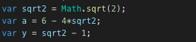
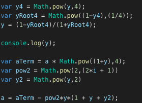

# Caluclating Value of PI

## Initialize

## Iteration - i

## Further Improvements
1. Calculate the value of PI for more decimal values
2. Use big.js (an open source project using node.js) to store more decimal places. For reference check [here](https://github.com/MikeMcl/big.js/).